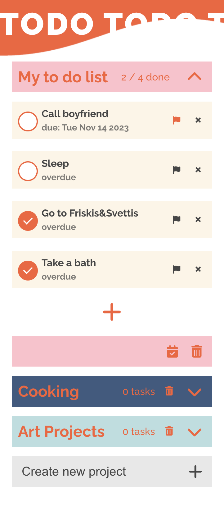

# Project Todos




A classic to do-app built in React using Redux.

## Functionality

The user can:
- Add new tasks with a due date
- Check if tasks are overdue
- Delete tasks
- Flag important tasks
- Toggle the completion of tasks
- Get the count of finished tasks
- Get the total count of tasks on the list
- Create and name new projects
- Delete projects
- Add, delete, toggle, flag tasks in projects

## The process

- Research design and functionality of commonly used in todo-apps
- Sketch and iterate on a layout and user flow
- Set up the store in Redux React
- Started off with the most basic functionality, i.e. creating reducers and actions to add and delete tasks
- Made sure the data moved properly between the components and the Redux store, using the console and Redux DevTool
- When everything worked I went on to add reducers and actions to toggle, flag and count tasks
- Then I moved on to work on more functionality: Reducers and actions to add new lists in an array, i.e. add new projects
- Added reducers and actions to delete lists + a functionality to toggle between opening and closing lists
- Added functionality to the list items in the lists in the array, i.e. toggle completion of tasks, flag tasks and count tasks
 \ 
- Parallell with all this I worked with Global Style/Styled Components and made the app responsive
- I got inspired by this [SVG wave animation in code pen](https://codepen.io/tedmcdo/pen/PqxKXg "Wave animation") and decided to manipulate it and place in the header section
 \ 
## Potential improvements to be made
- Work on styling, user flow and accessibility
- Work on backend, such as: authentication and to store all tasks and lists on a database
- Break down the react components a bit more
- Work with styled components more extensively
- Add extra functionality, such as being able to add a task to a specific project when creating it

## Installation Instructions

Follow these steps to clone and run the project locally:

1. Clone the repository
```
https://github.com/Vera-Sjunnesson/project-todos.git
```
2. Navigate to the project directory and code folder where the package.json file is located 
```
cd project-todos
```
then:
```
cd code
```
3. Install dependencies:
Ensure you have Node.js and npm installed on your machine. Then install the project dependencies using:
```
npm install
```
4. Start the Development Server:
Run the following command to start the development server and launch the app in your default web browser:
```
npm start
```
The app should automatically open in your browser at http://localhost:3000. If not, navigate to this URL manually.
5. Explore the App:
Explore the app, add tasks, create projects, and test out the functionality.

### Additional notes:
- Redux DevTools Extension: If you have the Redux DevTools Extension installed in your browser, you can use it to inspect and debug the state of your Redux store.
- Node.js: Make sure you have Node.js installed on your machine.
- npm (Node Package Manager): npm comes bundled with Node.js; however, ensure you have a recent version.

## Dependencies

- React
- ReactDOM
- Redux
- React-Redux
- Styled Components
- date-fns
- react-date-picker
- FontAwesome
- Eslint and related packages
- Uniqid
- react-global-style

## View it live

https://to-do-project-vera.netlify.app/


